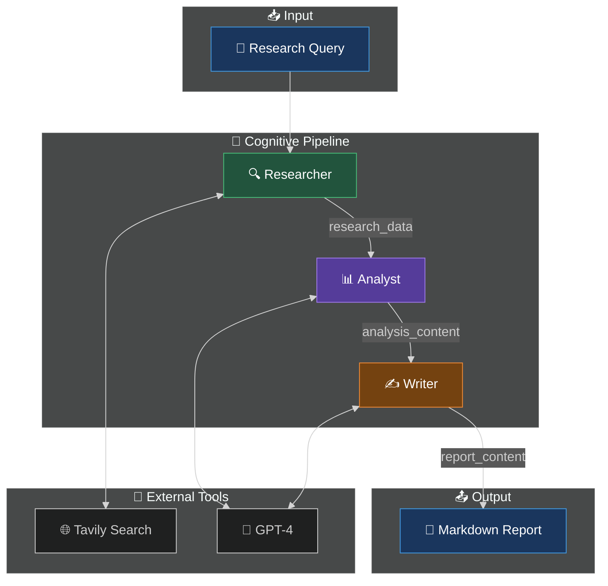

<div align="center">

```
  ██╗   ██╗ ██████╗ ██████╗ ████████╗███████╗██╗  ██╗
  ██║   ██║██╔═══██╗██╔══██╗╚══██╔══╝██╔════╝╚██╗██╔╝
  ██║   ██║██║   ██║██████╔╝   ██║   █████╗   ╚███╔╝ 
  ╚██╗ ██╔╝██║   ██║██╔══██╗   ██║   ██╔══╝   ██╔██╗ 
   ╚████╔╝ ╚██████╔╝██║  ██║   ██║   ███████╗██╔╝ ██╗
    ╚═══╝   ╚═════╝ ╚═╝  ╚═╝   ╚═╝   ╚══════╝╚═╝  ╚═╝
```

### 🌪️ L4 Deep Research Agent

[](https://www.python.org/)
[](https://github.com/langchain-ai/langgraph)
[](https://openai.com/)
[](#)

**Part of the Titan Protocol Initiative — System 02/300**

*Autonomous Research Pipeline: Search → Analyze → Report*

</div>

---

## 🏗️ Architecture



---

## 🔄 Pipeline Flow

| Stage | Agent | Input | Output | Tool |
|-------|-------|-------|--------|------|
| 1 | 🔍 Researcher | `task` | `research_data` | Tavily |
| 2 | 📊 Analyst | `research_data` | `analysis_content` | GPT-4 |
| 3 | ✍️ Writer | `analysis_content` | `report_content` | GPT-4 |

---

## 🚀 Quick Start

```bash
cd ~/VORTEX-L4-Deep-Research-Agent
source venv/bin/activate
python src/main.py
```

Output: `output_report.md` with full research report.

---

## 📁 Project Structure

```
src/
├── agents/
│   ├── researcher.py   # Tavily search node
│   ├── analyst.py      # GPT-4 analysis node
│   └── writer.py       # GPT-4 report generation
├── tools/
│   └── search.py       # Tavily integration
├── state/
│   └── graph.py        # AgentState TypedDict
├── utils/
│   └── llm.py          # LLM factory
└── main.py             # LangGraph orchestration
```

---

## 🛠️ Tech Stack

| Component | Technology |
|-----------|-----------|
| Orchestration | LangGraph |
| LLM | OpenAI GPT-4 |
| Search | Tavily API |
| State | TypedDict |

---

<div align="center">

**Built with 🐍 Python by [Davi Bonetto](https://github.com/DaviBonetto)**

*Part of the Titan Protocol Initiative — System 02/300*

</div>
