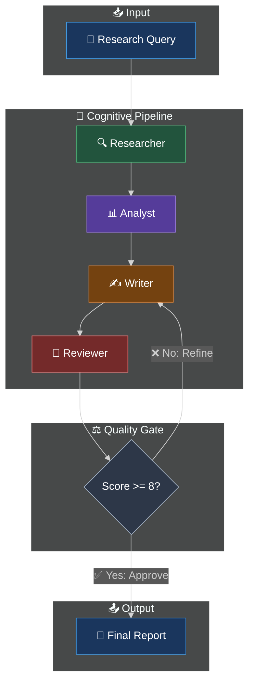

<div align="center">

```
  ██╗   ██╗ ██████╗ ██████╗ ████████╗███████╗██╗  ██╗
  ██║   ██║██╔═══██╗██╔══██╗╚══██╔══╝██╔════╝╚██╗██╔╝
  ██║   ██║██║   ██║██████╔╝   ██║   █████╗   ╚███╔╝ 
  ╚██╗ ██╔╝██║   ██║██╔══██╗   ██║   ██╔══╝   ██╔██╗ 
   ╚████╔╝ ╚██████╔╝██║  ██║   ██║   ███████╗██╔╝ ██╗
    ╚═══╝   ╚═════╝ ╚═╝  ╚═╝   ╚═╝   ╚══════╝╚═╝  ╚═╝
```

### 🌪️ L4 Autonomous Research Agent

[](https://www.python.org/)
[](https://github.com/langchain-ai/langgraph)
[](https://openai.com/)
[](#)

**Part of the Titan Protocol Initiative — System 02/300**

*Self-Improving Research Pipeline with Autonomous Quality Control*

</div>

---

## 🏗️ Architecture v2 — Cyclic Review Loop



---

## 🔄 Self-Improvement Loop

| Condition | Action |
|-----------|--------|
| `score < 8` | Reviewer sends critique → Writer revises |
| `score >= 8` | Report approved → Output |
| `revisions >= 3` | Force output (safety limit) |

---

## 🚀 Quick Start

```bash
cd ~/VORTEX-L4-Deep-Research-Agent
source venv/bin/activate
python src/main.py
```

---

## 📁 Project Structure

```
src/
├── agents/
│   ├── researcher.py   # Tavily search
│   ├── analyst.py      # Data synthesis
│   ├── writer.py       # Report generation (revision-aware)
│   └── reviewer.py     # Quality scoring & critique
├── state/
│   └── graph.py        # AgentState with score/critique
├── utils/
│   └── llm.py          # LLM factory
└── main.py             # Cyclic LangGraph orchestration
```

---

## ⚙️ Configuration

| Parameter | Default | Description |
|-----------|---------|-------------|
| `APPROVAL_THRESHOLD` | 8 | Minimum score to approve |
| `MAX_REVISIONS` | 3 | Maximum revision attempts |

---

<div align="center">

**Built with 🐍 Python by [Davi Bonetto](https://github.com/DaviBonetto)**

*Part of the Titan Protocol Initiative — System 02/300*

</div>
