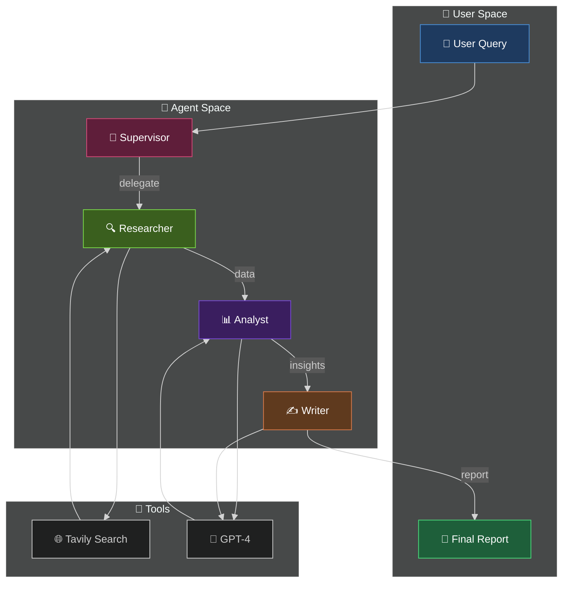

<div align="center">

```
  ██╗   ██╗ ██████╗ ██████╗ ████████╗███████╗██╗  ██╗
  ██║   ██║██╔═══██╗██╔══██╗╚══██╔══╝██╔════╝╚██╗██╔╝
  ██║   ██║██║   ██║██████╔╝   ██║   █████╗   ╚███╔╝ 
  ╚██╗ ██╔╝██║   ██║██╔══██╗   ██║   ██╔══╝   ██╔██╗ 
   ╚████╔╝ ╚██████╔╝██║  ██║   ██║   ███████╗██╔╝ ██╗
    ╚═══╝   ╚═════╝ ╚═╝  ╚═╝   ╚═╝   ╚══════╝╚═╝  ╚═╝
```

### 🌪️ L4 Deep Research Agent

[](https://www.python.org/)
[](https://github.com/langchain-ai/langgraph)
[](#)
[](LICENSE)

**Part of the Titan Protocol Initiative — System 02/300**

*Multi-Agent Research System with Autonomous Information Gathering*

</div>

---

## 🏗️ Architecture



---

## 🚀 Quick Start

```bash
cd ~/VORTEX-L4-Deep-Research-Agent
source venv/bin/activate
python src/main.py
```

---

## 📁 Project Structure

```
src/
├── agents/
│   └── researcher.py    # Research node implementation
├── tools/
│   └── search.py        # Tavily search integration
├── state/
│   └── graph.py         # AgentState definition
└── main.py              # LangGraph orchestration
```

---

## 🛠️ Tech Stack

| Component | Technology |
|-----------|-----------|
| Orchestration | LangGraph |
| LLM | OpenAI GPT-4 |
| Search | Tavily API |
| Validation | Pydantic |

---

<div align="center">

**Built with 🐍 Python by [Davi Bonetto](https://github.com/DaviBonetto)**

</div>
