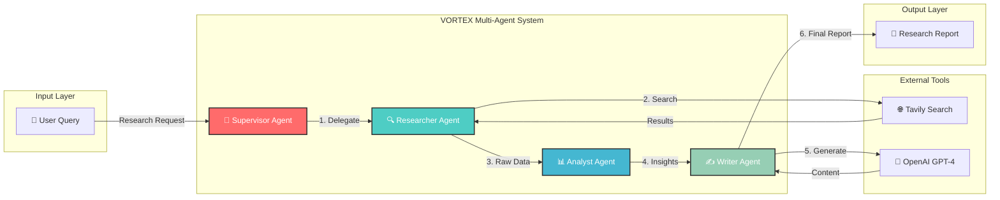

<div align="center">

```
  ██╗   ██╗ ██████╗ ██████╗ ████████╗███████╗██╗  ██╗
  ██║   ██║██╔═══██╗██╔══██╗╚══██╔══╝██╔════╝╚██╗██╔╝
  ██║   ██║██║   ██║██████╔╝   ██║   █████╗   ╚███╔╝ 
  ╚██╗ ██╔╝██║   ██║██╔══██╗   ██║   ██╔══╝   ██╔██╗ 
   ╚████╔╝ ╚██████╔╝██║  ██║   ██║   ███████╗██╔╝ ██╗
    ╚═══╝   ╚═════╝ ╚═╝  ╚═╝   ╚═╝   ╚══════╝╚═╝  ╚═╝
```

### 🌪️ L4 Deep Research Agent

[](https://www.python.org/)
[](https://github.com/langchain-ai/langgraph)
[](#)
[](LICENSE)

**Part of the Titan Protocol Initiative — System 02/300**

*Multi-Agent Research System with Autonomous Information Gathering and Report Generation*

[Quick Start](#-quick-start) •
[Architecture](#-architecture) •
[Agents](#-agents) •
[Usage](#-usage)

</div>

---

## 🏗️ Architecture



### Agent Responsibilities

| Agent | Role | Tools |
|-------|------|-------|
| **🎯 Supervisor** | Orchestrates workflow, delegates tasks | LangGraph routing |
| **🔍 Researcher** | Gathers information from the web | Tavily Search API |
| **📊 Analyst** | Processes and synthesizes data | GPT-4 analysis |
| **✍️ Writer** | Generates final report | GPT-4 generation |

---

## 🚀 Quick Start

### 1. Clone and Setup

```bash
git clone https://github.com/DaviBonetto/VORTEX-L4-Deep-Research-Agent.git
cd VORTEX-L4-Deep-Research-Agent

# Create virtual environment
python3 -m venv venv
source venv/bin/activate  # Linux/Mac
# or: venv\Scripts\activate  # Windows

# Install dependencies
pip install -r requirements.txt
```

### 2. Configure Environment

```bash
cp .env.example .env
# Edit .env with your API keys
```

### 3. Test Connection

```bash
python src/main.py
```

Expected output:
```
🌪️ VORTEX System Initializing...
✅ OpenAI Key Loaded
✅ Tavily Key Loaded
🚀 VORTEX Ready for Deep Research Operations
```

---

## 📁 Project Structure

```
VORTEX-L4-Deep-Research-Agent/
├── src/
│   ├── agents/          # LangGraph agent definitions
│   ├── tools/           # External tool integrations
│   ├── state/           # Graph state management
│   └── main.py          # Entry point
├── notebooks/           # Jupyter experiments
├── tests/               # Pytest test suite
├── requirements.txt     # Python dependencies
├── .env.example         # Environment template
└── README.md            # This file
```

---

## 🔧 Configuration

| Variable | Description | Required |
|----------|-------------|----------|
| `OPENAI_API_KEY` | OpenAI API key for GPT-4 | ✅ Yes |
| `TAVILY_API_KEY` | Tavily API key for web search | ✅ Yes |

---

## 🛠️ Tech Stack

| Component | Technology | Purpose |
|-----------|-----------|---------|
| **Orchestration** | LangGraph | Multi-agent workflow management |
| **LLM Framework** | LangChain | LLM abstraction and chaining |
| **Language Model** | OpenAI GPT-4 | Reasoning and generation |
| **Web Search** | Tavily API | Real-time information retrieval |
| **Validation** | Pydantic | Data modeling and validation |

---

## 📜 License

This project is licensed under the **MIT License** - see the [LICENSE](LICENSE) file for details.

---

<div align="center">

**Built with 🐍 Python by [Davi Bonetto](https://github.com/DaviBonetto)**

*Part of the Titan Protocol Initiative — System 02/300*

</div>
